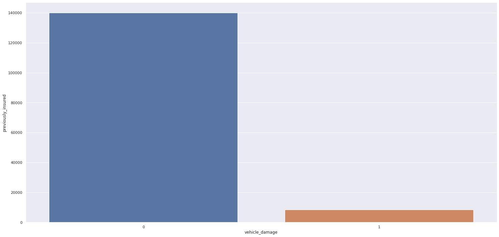
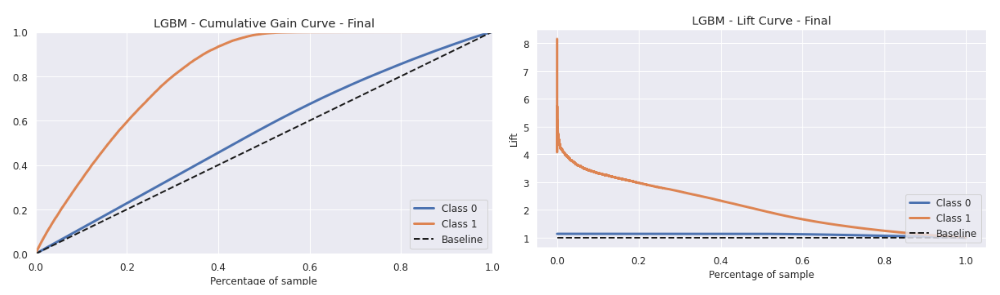
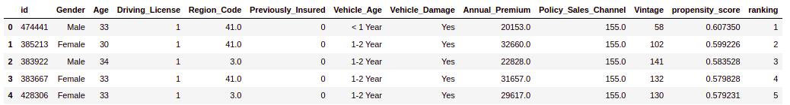
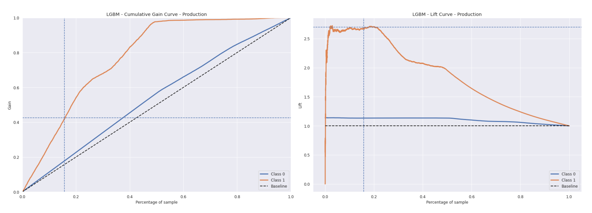
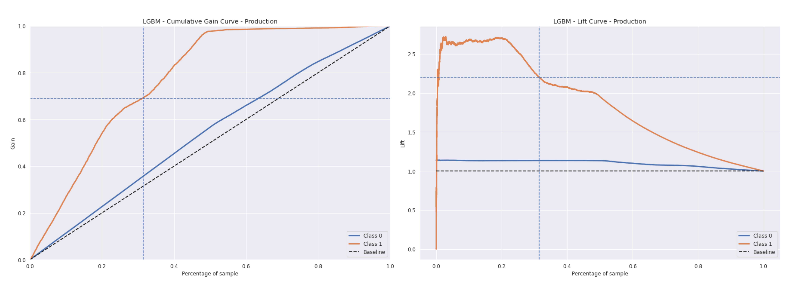
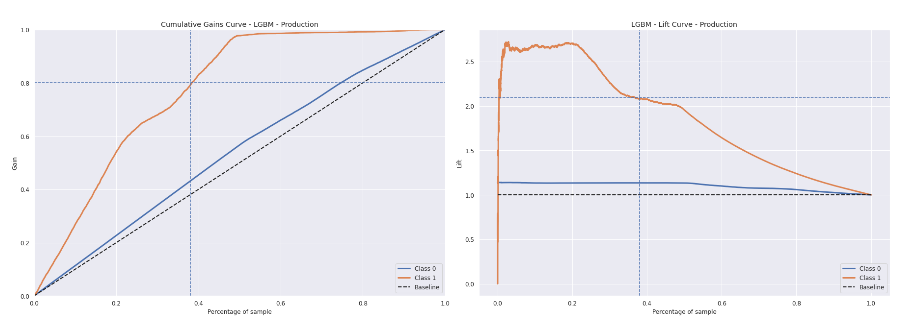

### :pushpin: [__Read in Portuguese__](https://github.com/feliperastelli/FR_Health_Insurance_Cross_Sell/blob/main/README.md)

# Health Insurance - Cross Sell

The objective of this project is to provide the company with a machine learning model that calculates the propensity of interest of new customers to purchase a new product from the company, ranking them by their calculated "score". That is, using a ranking model for a *Learning to Rank* problem

The project was developed using the CRISP-DM technique, and at the end of the first development cycle it was possible to produce a model with the following calculated metrics results:

- Precision @K: 0.3826
- Recall @K: 0.4913

*K precision is the proportion of recommended items in the top-k set that are relevant*

*Recall in k is the proportion of relevant items found in the top-k recommendations*

In financial terms, the model presented allows a result 2.7x better than the random method of customer selection, having an estimate (assumed values)

|***20K***  |***Cost*** | ***Revenue*** | ***Profit*** |
| ----------| --------------| ------------- |------------ |
| Random    | 4.017.600,00  | 401.760.000,00 |	397.742.400,00 |
| Model     |10.845.656,84  | 1.084.565.683,80 |1.073.720.026,96  |

- Difference in $: 675,977,626.96 | Difference in %: 169.95%

To view the ranking result, a spreadsheet was built on the Google platform, so that the user can enter the data of new customers (or a list) and have a return of their calculated "score" and the ordering of these new customers.

To access, simply access the spreadsheet, and access the "Health Insurance Prediction" function. Take the test: encurtador.com.br/vFGVZ

## 1. About Insurance All

### 1.1 Business Context:

Insurance All is a fictitious company that provides health insurance as its main product to its customers. In this context, the product team is analyzing the possibility of offering policyholders a new product: __A car insurance__. As with health insurance, customers of this new car insurance plan need to pay an amount annually to Insurance All to obtain an amount guaranteed by the company, destined to the costs of an eventual accident or damage to the vehicle.

Insurance All surveyed nearly __380,000 customers__ about their interest in joining a new auto insurance product last year. All customers showed interest or not in purchasing auto insurance and these responses were saved in a database along with other customer attributes.

The product team selected __127,000 new customers__ who did not respond to the survey to participate in a campaign, in which they will be offered the new auto insurance product. The offer will be made by the sales team through phone calls.

### 1.2 Business Question:

Given the above context, it is known that the sales team has the capacity to make only __20 thousand calls__ within the campaign period. In other words, to carry out this campaign, the company has limited resources and needs to reach, with priority, the people who are supposed to be interested in the new product.

The business team defined the following questions to be evaluated and answered within this project:

- Main Insights on the most relevant attributes of customers interested in purchasing auto insurance.
- What percentage of customers interested in purchasing auto insurance will the sales team be able to contact by making 20,000 calls?
- And if the sales team's capacity increases to 40,000 calls, what percentage of customers interested in purchasing auto insurance will the sales team be able to contact?
- How many calls does the sales team need to make to contact 80% of customers interested in purchasing auto insurance?

### 1.3 About the data:

The data was made available by the company on the Kaggle platform: https://www.kaggle.com/anmolkumar/health-insurance-cross-sell-prediction

|***Attribute*** | ***Description*** |
| -------- | --------- |
|**Id** | customer unique identifier |
|**Gender** | customer gender |
|**Age** | customer age |
|**Driving License** | 0, the client is not allowed to drive and 1, the client has to drive (CNH – National Driver's License) |
|**Region Code** | customer region code |
|**Previously Insured** | 0, customer does not have auto insurance and 1, customer already has auto insurance |
|**Vehicle Age** | vehicle age |
|**Vehicle Damage** | 0 customer has never had his vehicle damaged in the past and 1 customer has had his vehicle damaged in the past |
|**Annual Premium** | amount the customer paid the company for annual health insurance |
|**Policy sales channel** | anonymous code for customer contact channel |
|**Vintage** | number of days the customer joined the company through the purchase of health insurance |
|**Response** | 0, customer is not interested and 1, customer is interested |

### 1.4 Business Assumptions:

- The original data, with the response variable, were used for training and testing.
- To analyze and answer the proposed questions, production data (127k) were used.

## 2. Solution Planning:

The project was developed using the CRISP-DM method, applying the following steps:

**Step 01 - Description of the data:** In this step, the objective was to know the data, its types, use statistical metrics to identify outliers in the business scope and also analyze basic statistical metrics such as: average, median, maximum, minimum, range, skew, kurtosis and standard deviation. At this stage, a large data imbalance was observed, but the balance was not applied in this project cycle.

**Step 02 - Feature Engineering:** In this step, a mental map was developed to analyze the phenomenon, its variables and the main aspects that impact each variable. In this cycle, no feature derivation was performed, only some changes were made.

**Step 03 - Data filtering:** There was no need to perform data filtering.

**Step 04 - Exploratory Data Analysis:** The objective of this step was to explore the data to find insights, better understand the relevance of variables in learning the model. Univariate, bivariate and multivariate analyzes were performed, using the numerical and categorical data of the set.

**Step 05 - Data preparation:** In this step, the data were prepared for the beginning of the applications of machine learning models. Techniques such as Standardization, Rescaling and Encoder were used to rescale and standardize some features.

**Step 06 - Feature Selection:** The objective of this step was to select the best attributes to train the model. The Boruta algorithm and the Features Importance technique were used to select the variables, highlighting those that were most relevant to the phenomenon.

**Step 07 - Machine Learning Modeling:** In this stage, tests and training of some machine learning models were carried out, where it was possible to compare their respective performances and choose the ideal model for the project. For all, the Cross Validation technique was also used to guarantee the real performance on the selected data.

**Step 08 - Hyperparameter Fine Tunning and Final Model:** Having chosen the algorithm after the previous step, a randomization was performed to choose the best values ​​for each of the model parameters. After that, the training and validation data were unified to train the final model, which was evaluated under the test data to verify the generalization power.

**Step 09 - Business Performance:** The objective of this step was in fact to demonstrate the result of the project, applying the model trained on the production data. The final objectives of the project were then developed, where the business questions were analyzed and answered.

**Step 10 - Deploy the model in production:** After successful execution of the model, the objective was to publish it in a cloud environment so that other people or services can access it. The chosen cloud hosting platform was Heroku.

**Step 11 - Google Spreadsheet:** As an extra, a spreadsheet was developed on the Google platform, which allows the user to list new customers, and when requesting the prediction, the spreadsheet will use the model in production and will rank the customers through their "score" result.

## 3. Main insights - Hypotheses:

**Hypothesis 1:** Most customers with newer cars already have insurance.
   **True:** Customers who own newer cars already have vehicle insurance, so they would not be interested in a new product.

**Hypothesis 2:** Customers who pay more for health insurance annually are less interested in purchasing another one.
   **True:** There is a greater concentration of interested customers among those paying smaller amounts of health insurance.

**Hypothesis 3:** Customers with vehicles that have already been damaged, without most of them, already have insurance.
   **False:** Most customers who have already suffered damage to their vehicles do not have car insurance.
  
   

*Other insights can be consulted in the project notebook.*

## 4. Performance of Machine Learning Models:

In the case of a *Learning to Rank* problem, ranking algorithms were used to calculate each customer's propensity to accept the new product. With the "score" values determined, the objective was to order them from highest to lowest, evaluating the ability of the Model to rank the highest propensities at the top. For this project, the following algorithms were selected:

**- Models Used:**

    - K Neighbors Classifier - KNN
    - Logistic Regression
    - Random Forest Classifier
    - Gradient Boosting Classifier - XGBoost
    - Light Gradient Boosting Machine Classifier - LGBM
    
 **Comparison of model performance:**

*The metrics chosen to evaluate the model were PRECISION @K and RECALL @K, precisely because it is a learning to rank project*

|***Model Name*** | ***Size MB*** | ***Precision@k*** | ***Recall@k*** | ***Precision@k_CV*** | ***CV_STD*** | ***Recall@k_CV*** |***CV_STD_Recall*** |
| --------------- | -------------- | ------------------ | -------------- |--------------------- |-------------- |------------------ |------------------- |
|K Neighbors Classifier | 33.885993 | 0.310068 | 0.394586 | 0.263660 | 0.001747 | 0.848534 | 0.005564 |
|Logistic Regression |0.000762 | 0.309283 | 0.393588 |0.268140 | 0.001454 | 0.862952 | 0.004704 |
|Random Forest Classifier |6.585246 | 0.365552 | 0.465195 |0.283717 | 0.001355 | 0.913083 | 0.004371 |
|XGBoost Classifier |0.118501 | 0.364180 | 0.463448 |0.283511 | 0.001783 | 0.912420 | 0.005692 |
|LGBM Classifier |0.334826 | 0.364082 | 0.463323 |0.284217 | 0.001085 | 0.914692 | 0.003511 |

**Final performance of the chosen model after Hyperparameter Fine Tuning + joining of training and validation data:**

|***Model Name*** | ***Size MB*** | ***Precision@k*** | ***Recall@k*** |
| --------------- | -------------- | ------------------ | --------------- |
|LGBM Classifier | 0.58101 | 0.3826 |0.4913 |

The choice of model took into account the size of the model created, avoiding very dense models that could result in costs for their use - in this aspect, the use of Random Forest was discarded, and because there is a lot of similarity in the results between XGBoost and LGBM , by choice, the LGBM was used.

**Model Generalization:**

|***Date*** |***Precision@k*** | ***Recall@k*** |
| ----------| ------------------| --------------- |
| Validation | 0.371924 | 0.473303 |
| Test | 0.326964 | 0.420609 |

## 5. Issues and Business Performance

The final result of the project was satisfactory for most of the stores covered in the data, as shown in the chart below (These specific stores may have particularities and possibly in a second cycle of this project, something could be done to improve the performance and prediction for them).

### a) Main Insights into the most relevant attributes of customers interested in purchasing auto insurance:

- Customers who have already had damage to their vehicles are more interested in purchasing car insurance;
- Customers aged between 30 and 55 are more interested in purchasing car insurance;
- Customers who pay annual health insurance in amounts between $30,000 to $40,000 have higher interest and a new product.

### b) Reach with 20,000 calls:

- With 20,000 connections, which represents 15.74% of the dataset, approximately 42.5% of customers interested in the dataset can be contacted;
- The result using the model will be approximately 2.7x better than the random result

  

### c) Reach with 40,000 calls:

- With 40,000 connections, which represents 31.48% of the dataset, approximately 69% of customers interested in the dataset can be contacted;
- The result using the model will be approximately 2.2x better than the random result

  
  
### c) Links needed to reach 80% of interested customers:

- 80% of interested customers represent 38% of customers in the dataset.
- It will take 48,274 calls to contact 80% of interested customers.
- With 48,274 calls the result will be approximately 2.10x better than the random result
  
  

## 6. Financial Results

- Considering that the average value of auto insurance is US$ 1,674 (according to 2022 data extracted from Quadrant Information Services);

- That the cost of the operation, of producing the product plus the CAC, is 1% of the value of the product - $ 16.74, and;

- The calculated value is a maximum estimate:

|***20K*** |***Cost*** | ***Revenue*** | ***Profit*** |
| ----------| ---------------| ------------- |------------ |
| Random | 4,017,600.00 | 401,760,000.00 | 397,742,400.00 |
| Model |10,845,656.84 | 1,084,565,683.80 | 1,073,720,026.96 |

Difference in $: 675,977,626.96 | Difference in %: 169.95%

|***40K*** |***Cost*** | ***Revenue*** | ***Profit*** |
| ----------| ---------------| ------------- |------------ |
| Random | 8,035,200.00 | 803,520,000.00 | 795,484,800.00 |
| Model |17,608,242.87 | 1,760,824,286.64 | 1,743,216,043.77 |

Difference in $: 947,731,243.77 | Difference in %: 119.14%

## 7. Conclusion

The developed project was successfully completed, even considering the low number of features available, where it was possible to verify through the metrics (Top K), how much the model excels in relation to the random method. Through this project, it is possible to verify the importance of using the *Learning to Rank* technique in companies or projects with limited resources, a technique that can still be applied in recommender systems, research systems and window ordering.

- The deployment of the model developed and the Google Spreadsheet application were built in the **Heroku** cloud environment and are working.

- All project documentation can be consulted in the repository, including developed notebooks and all final scripts for web applications.

## Next Cycles

- Apply new feature derivations;
- Perform data balancing;
- Apply other ML models.
