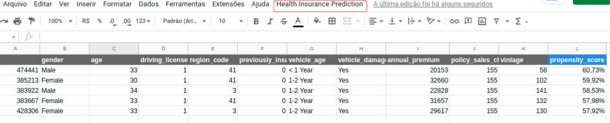
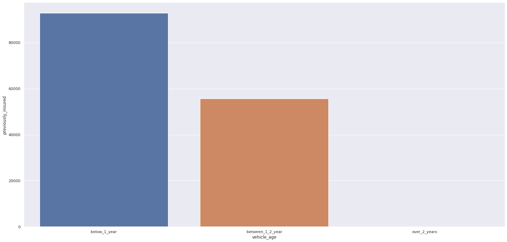
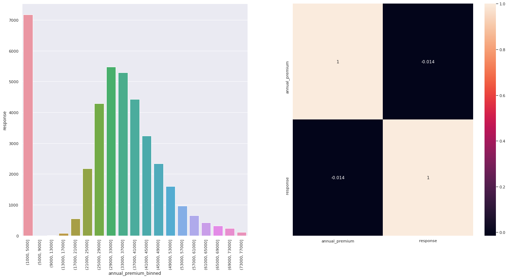
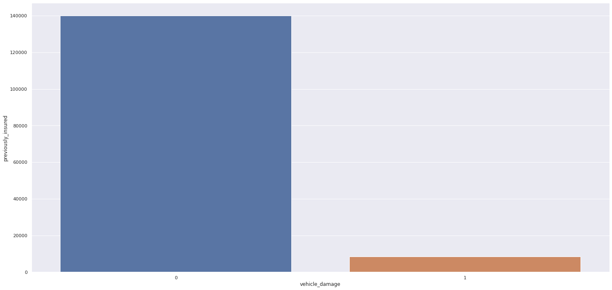
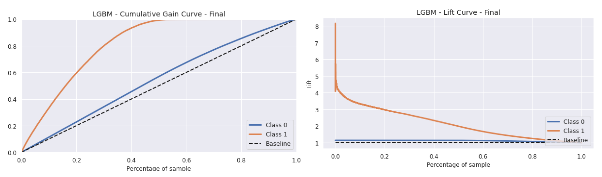
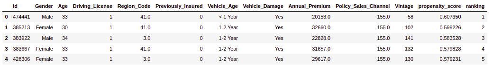
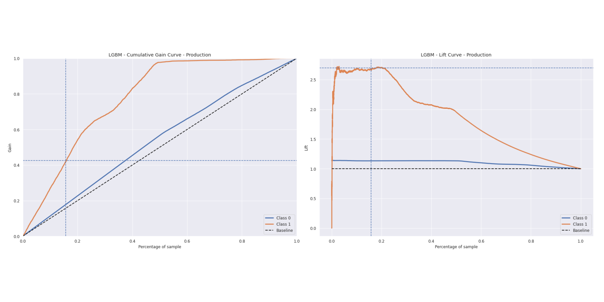
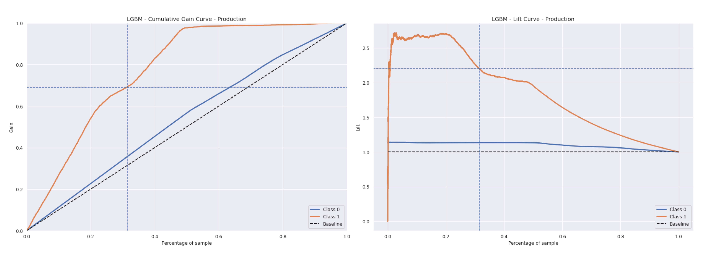
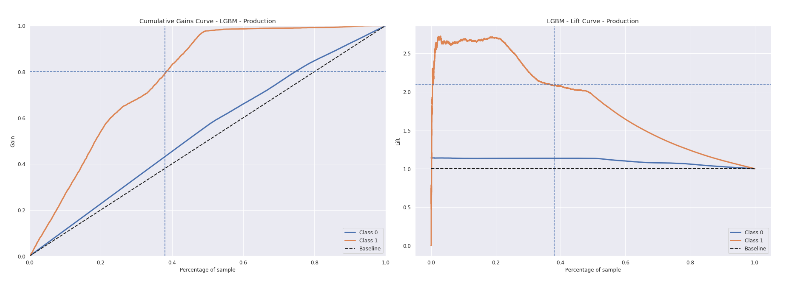

### :pushpin: [__Read in English__](https://github.com/feliperastelli/FR-Rossmann_Sales_Model/blob/main/README-en.md)

# Health Insurance - Cross Sell

O objetivo desse projeto é fornecer para a empresa, um modelo de machine learning que calcule a propensão de interesse dos novos clientes em adquirir um novo produto da empresa, ranqueando-os pelo seu "score" calculado. Ou seja, utilizar um modelo de classificação para um problema de *Learning to Rank*

O projeto foi desenvolvido através da técnica CRISP-DM, e ao final do primeiro ciclo de desenvolvimento foi possível produzir um modelo os seguintes resultados de métricas calculadas:

- Precision @K: 0.3826
- Recall @K: 0.4913

*Precisão em k é a proporção de itens recomendados no conjunto top-k que são relevantes*

*Recall em k é a proporção de itens relevantes encontrados nas recomendações top-k*

Em termos financeiros, o modelo apresentado, permite um resultado 2,7x melhor que método aleatório de seleção dos clientes, tendo uma estimativa (valores assumidos)

|***20K***  |***Custo*** | ***Receita*** | ***Lucro*** |
| ----------| --------------| ------------- |------------ |
| Random    | 4.017.600,00  | 401.760.000,00 |	397.742.400,00 |
| Model     |10.845.656,84  | 1.084.565.683,80 |1.073.720.026,96  |

 - Diferença em $: 675.977.626,96 | Diferença em %: 169,95%

Para visualização do resultado do ranking, foi construído uma planilha na plataforma do Google, para que o usuário possa inserir os dados de novos clientes (ou uma lista) e ter retorno do seu "score" calculado e a ordenação desses novos clientes.

Para acessar basta acessar a planilha, e acessar a função "Health Insurance Prediction". Faça o teste: encurtador.com.br/vFGVZ

## 1. Sobre a Insurance All

### 1.1 Contexto do negócio:

A Insurance All é uma empresa fictícia que fornece como produto principal, seguro de saúde para seus clientes. Nesse contexto, time de produtos está analisando a possibilidade de oferecer aos segurados, um novo produto: __Um seguro de automóveis__.Assim como o seguro de saúde, os clientes desse novo plano de seguro de automóveis precisam pagar um valor anualmente à Insurance All para obter um valor assegurado pela empresa, destinado aos custos de um eventual acidente ou dano ao veículo.

A Insurance All fez uma pesquisa com cerca de __380 mil clientes__ sobre o interesse em aderir a um novo produto de seguro de automóveis, no ano passado. Todos os clientes demonstraram interesse ou não em adquirir o seguro de automóvel e essas respostas ficaram salvas em um banco de dados junto com outros atributos dos clientes.

O time de produtos selecionou __127 mil novos clientes__ que não responderam a pesquisa para participar de uma campanha, no qual receberão a oferta do novo produto de seguro de automóveis. A oferta será feita pelo time de vendas através de ligações telefônicas.

### 1.2 Questão de negócio:

Dado o contexto acima, sabe-se que time de vendas tem uma capacidade de realizar apenas __20 mil ligações__ dentro do período da campanha. Ou seja, para realizar essa campanha, a empresa possui recursos limitados e precisa alcançar com prioridade, às pessoas que de supostamente estarão interessadas no novo produto.

O time de negócios definiu as seguintes questões à serem avaliadas e respondidas dentro desse projeto:

- Principais Insights sobre os atributos mais relevantes de clientes interessados em adquirir um seguro de automóvel.
- Qual a porcentagem de clientes interessados em adquirir um seguro de automóvel, o time de vendas conseguirá contatar fazendo 20.000 ligações?
- E se a capacidade do time de vendas aumentar para 40.000 ligações, qual a porcentagem de clientes interessados em adquirir um seguro de automóvel o time de vendas conseguirá contatar? 
- Quantas ligações o time de vendas precisa fazer para contatar 80% dos clientes interessados em adquirir um seguro de automóvel? 

### 1.3 Sobre os dados:

Os dados foram disponibilizados pela empresa na plataforma do Kaggle: https://www.kaggle.com/anmolkumar/health-insurance-cross-sell-prediction

|***Atributo*** | ***Descrição*** |
| -------- | --------- |
|**Id** | identificador único do cliente |
|**Gender** | gênero do cliente |
|**Age** | idade do cliente |
|**Driving License** |  0, o cliente não tem permissão para dirigir e 1, o cliente tem para dirigir ( CNH – Carteira Nacional de Habilitação ) |
|**Region Code** | código da região do cliente |
|**Previously Insured** |  0, o cliente não tem seguro de automóvel e 1, o cliente já tem seguro de automóvel |
|**Vehicle Age** |  idade do veículo |
|**Vehicle Damage** | 0, cliente nunca teve seu veículo danificado no passado e 1, cliente já teve seu veículo danificado no passado | 
|**Anual Premium** | quantidade que o cliente pagou à empresa pelo seguro de saúde anual | 
|**Policy sales channel** |  código anônimo para o canal de contato com o cliente | 
|**Vintage** | número de dias que o cliente se associou à empresa através da compra do seguro de saúde | 
|**Response** | 0, o cliente não tem interesse e 1, o cliente tem interesse | 

### 1.4 Premissas do negócio:

- Os dados originais, com a variável resposta, foram utilizados para treino e teste.
- Para analisar e responder as questões propostas, foram utilizados os dados de produção (127k).

## 2. Planejamento da solução:

O projeto foi desenvolvido através do método CRISP-DM, aplicando os seguintes passos:

**Passo 01 - Descrição dos dados:** Nessa etapa, o objetivo foi conhecer os dados, seus tipos, usar métricas estatísticas para identificar outliers no escopo do negócio e também analisar métricas estatísticas básicas como: média, mediana, máximo, mínimo, range, skew, kurtosis e desvio padrão. Nessa etapa foi observado um grande desbalanceamento dos dados, mas não foi aplicado o balanceamento nesse ciclo do projeto.

**Passo 02 - Feature Engineering:** Nessa etapa, foi desenvolvido um mapa mental para analisar o fenômeno, suas variáveis e os principais aspectos que impactam cada variável. Nesse ciclo, não foi realizada nenhuma derivação de features, apenas a alteração de algumas.

**Passo 03 - Filtragem dos dados:** Não houve necessidade de realizar filtragem dos dados.

**Passo 04 - Análise Exploratória dos dados:** O objetivo desta etapa foi explorar os dados para encontrar insights, entender melhor a relevância das variáveis no aprendizado do modelo. Foram feitas analises univariadas, biváriadas e multivariadas, utilizandos os dados numéricos e categóricos do conjunto.

**Passo 05 - Preparação dos dados:** Nessa etapa,  os dados foram preparados para o inicio das aplicações de modelos de machine learning. Foram utilizadas técnicas como Standardization, Rescaling e Encoder, para reescalar e padronizar algumas features.

**Passo 06 - Seleção de Features:** O objetivo desta etapa foi selecionar os melhores atributos para treinar o modelo. Foram utilizados o algoritmo Boruta e a técnica de Features Importance, para fazer a seleção das variáveis, destacando as que tinham maior relevância para o fenômeno.

**Passo 07 - Modelagem de Machine Learning:** Nessa etapa foram feitos os testes e treinamento de alguns modelos de machine learning, onde foi possível comparar suas respectivas performances e feita a escolha do modelo ideal para o projeto. Para todos, foi utilizada também a técnica de Cross Validation para garantir a performance real sobre os dados selecionados.

**Passo 08 - Hyperparameter Fine Tunning e Modelo Final:** Tendo a escolha do algorotimo após a etapa anterior, foi feita uma randomização para escolher os melhores valores para cada um dos parâmetros do modelo. Após isso, os dados de treino e validação foram unificados para treinamento do modelo final, que foi avaliado sob os dados de teste para verificar o poder de generalização.

**Passo 09 - Performance de Negócio:** O objetivo dessa etapa foi de fato demonstrar o resultado do projeto, aplicando o modelo treinado sobre os dados de produção. Os objetivos finais do projeto foram então desenvolvidos, onde as questões do negócio foram analisadas e respondidas.

**Passo 10 - Deploy do modelo em produção:** Após execução bem sucedida do modelo, o objetivo foi publica-lo em um ambiente de nuvem para que outras pessoas ou serviços possam acessá-lo. A plataforma para hospedagem em nuvem escolhida foi o Heroku.

**Passo 11 - Planilha Google:** Como um extra, foi desenvolvida uma planilha na plataforma do Google, que permite ao usuário listar os novos clientes, e ao solicitar a predição, a planilha utilizará do modelo em produção e fará o ranking dos clientes através do seu resultado de "score".

## 3. Principais insights - Hipóteses:

**Hipótese 1:** A maioria dos clientes com carros mais novos já tem seguro.
  **Verdadeira:** Clientes que possuem carros mais novos, já possuem seguro veicular, logo não teriam interesse em um novo produto.

**Hipótese 2:** Clientes que pagam mais pelo seguro de saúde anualmente estão menos interessados em comprar outro.
  **Verdadeira:** Há uma concentração maior de clientes interessados dentro dos que pagam quantias menores de seguro de saúde.

**Hipótese 3:** Clientes com veículos já danificados, sem sua maioria, já possuem seguro.
  **Falsa:** A maior parte dos clientes que já sofreram danos em seus veículos, não possuem seguro de automóvel.
  
  

*Demais insights podem ser consultados no notebook do projeto.*

## 4. Performance dos Modelos de Machine Learning:

Se tratando de um problema de *Learning to Rank*, foram utilizados algoritmos de classificação para calcular a cada cliente, sua propensão em aceitar o novo produto. Com os valores de "score" determinados, o objetivo foi ordená-los do maior para o menor, avaliando a capacidade que o Modelo teve de ranquear as maiores propensões no topo. Para esse projeto, foram selecionados os seguintes algorítmos: 

**- Modelos Utilizados:**

   - K Neighbors Classifier - KNN
   - Logistic Regression 
   - Random Forest Classifier
   - Gradient Boosting Classifier - XGBoost
   - Light Gradient Boosting Machine Classifier - LGBM

**Comparação da performance dos modelos:**

*As métricas escolhidas para avaliar o modelo foram a PRECISION @K e RECALL @K, justamente por ser um projeto de learning to rank*

|***Model Name*** | ***Size MB*** | ***Precision@k*** | ***Recall@k*** | ***Precision@k_CV*** | ***CV_STD*** | ***Recall@k_CV*** |***CV_STD_Recall*** |
| -------------- | ------------- | ----------------- | -------------- |--------------------- |------------- |------------------ |------------------- |
|K Neighbors Classifier  | 33.885993 | 0.310068 | 0.394586 | 0.263660 | 0.001747	 | 0.848534	 | 0.005564 |
|Logistic Regression        |0.000762 | 0.309283 | 0.393588 |0.268140 | 0.001454 | 0.862952 | 0.004704 |
|Random Forest Classifier   |6.585246 | 0.365552 | 0.465195	 |0.283717 | 0.001355 | 0.913083 | 0.004371 |
|XGBoost Classifier         |0.118501 | 0.364180 | 0.463448	 |0.283511	 | 0.001783 | 0.912420 | 0.005692 |
|LGBM Classifier            |0.334826 | 0.364082 | 0.463323 |0.284217 | 0.001085 | 0.914692 | 0.003511 |

**Performance final do modelo escolhido após Hyperparameter Fine Tuning + junção dos dados de treino e validação:**

|***Model Name*** | ***Size MB*** | ***Precision@k*** | ***Recall@k*** | 
| -------------- | ------------- | ----------------- | -------------- |
|LGBM Classifier | 0,58101       | 0.3826	 |0.4913 |

A escolha do modelo levou em consideração o tamanho do modelo criado, evitando modelos muito densos e que poderiam acarretar em custos para sua utilização - nesse aspecto descartou-se o uso da Random Forest, e por haver muita semelhança nos resultados entre o XGBoost e LGBM, por opção, foi utilizado o LGBM.

**Generalização do Modelo:**

|***Data***  |***Precision@k*** | ***Recall@k*** | 
| ----------| -----------------| -------------- |
| Validação | 0.371924         | 0.473303	      |
| Teste     | 0.326964         | 0.420609	      |

## 5. Questões e Performance de Negócio

O resultado final do projeto foi satisfatório para a maior parte das lojas abrangidas nos dados, conforme gráfico abaixo (Essas lojas em específico podem conter particularidades e possivelmente num segundo ciclo desse projeto, algo poderia ser feito para melhor a performance e predição para elas).

### a) Principais Insights sobre os atributos mais relevantes de clientes interessados em adquirir um seguro de automóvel:

- Clientes que já tiveram danos em seus veículos possuem maior interesse em adquirir seguro de automóvel;
- Clientes com idade entre 30 a 55 anos possuem maior interesse em adquirir seguro de automóvel;
- Clientes que pagam seguros de saúde anuais nos valores entre $ 30.000 a $ 40.000 tem maior interesse e um novo produto.

### b) Alcance com 20.000 ligações:

- Com 20.000 ligações, o que representa 15,74% do conjunto de dados, pode-se contatar aproximadamente 42,5% dos clientes interessados no conjunto de dados;
- O resultado com a utilização do modelo, será aproximadamente 2,7x melhor que o resultado aleatório

  

### c) Alcance com 40.000 ligações:

- Com 40.000 ligações, o que representa 31,48% do conjunto de dados, pode-se contatar aproximadamente 69% dos clientes interessados no conjunto de dados;
- O resultado com a utilização do modelo, será aproximadamente 2,2x melhor que o resultado aleatório

  
  
### c) Ligações necessárias para atingir 80% dos clientes interessados:

- 80% dos clientes interessados representam 38% dos clientes no conjunto de dados.
- Serão necessárias 48.274 ligações para contatar 80% dos clientes interessados.
- Com 48.274 chamadas o resultado será aproximadamente 2,10x melhor que o resultado aleatório
  
  

## 6. Resultados Financeiros

- Considerando que o valor médio do seguro de automóveis é de US$ 1.674 (conforme dados de 2022 extraídos do Quadrant Information Services);

- Que o custo da operação, de produção do produto e mais o CAC, seja de 1% do valor do produto - $ 16,74, e;

- O valor calculado é uma estimativa máxima:

|***20K***  |***Custo*** | ***Receita*** | ***Lucro*** |
| ----------| --------------| ------------- |------------ |
| Random    | 4.017.600,00  | 401.760.000,00 |	397.742.400,00 |
| Model     |10.845.656,84  | 1.084.565.683,80 |1.073.720.026,96  |

Diferença em $: 675.977.626,96 | Diferença em %: 169,95%

|***40K***  |***Custo*** | ***Receita*** | ***Lucro*** |
| ----------| --------------| ------------- |------------ |
| Random    | 8.035.200,00  | 803.520.000,00 |	795.484.800,00 |
| Model     |17.608.242,87  | 1.760.824.286,64 |1.743.216.043,77 |

Diferença em $: 947.731.243,77  | Diferença em %: 119,14%

## 7. Conclusão

O projeto desenvolvido foi concluído com êxito, mesmo considerando o baixo número de features disponibilizadas, onde foi possível verificar através das métricas (Top K), o quanto o modelo se supera com relação ao método randômico. Através desse projeto, pode-se verificar a importância da utilização da técnica de *Learning to Rank* em empresas ou projetos com recursos limitados, técnica essa que pode ainda ser aplicada em sistemas de recomendação, sistemas de pesquisas e ordenação de vitrine.

- O deploy do modelo desenvolvido e da aplicação da Planilha Google foram construídos no ambiente em nuvem do **Heroku** e estão em funcionamento.

- Toda documentação do projeto pode ser consultada no repositório, incluindo os notebooks desenvolvidos e todos os scritps finais para as aplicações web.

## Próximos Ciclos

- Aplicar novas derivações de features;
- Realizar balanceamento dos dados;
- Aplicar outros modelos de ML.
